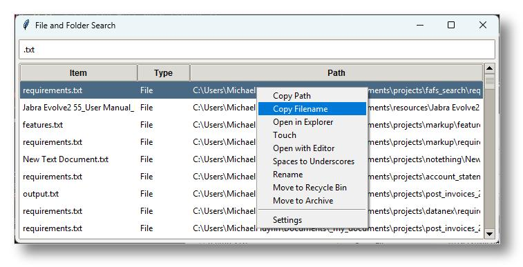

# File and Folder Search

A simple file and folder search utility built with Python and Tkinter.



## Features

- Real-time search as you type
- Search through files and folders in current directory and subdirectories
- Double-click to open files/folders
- Right-click context menu with options:
  - Copy Path
  - Copy Filename
  - Open in Explorer
  - Touch (update timestamp)
  - Open with Editor (for text files)
  - Convert Spaces to Underscores
  - Rename
  - Move to Recycle Bin
  - Move to Archive
- Keyboard shortcuts:
  - F2: Rename selected item
  - Ctrl+Backspace: Delete previous word in search
  - Enter: Open selected item

## Requirements

- Python 3.x
- pyperclip
- send2trash

## Installation

1. Clone or download this repository
2. Install the required packages:
   ```bash
   pip install -r requirements.txt
   ```

## Usage

Run `search.pyw` to start the application. Type in the search box to filter files and folders.

## Autostart Setup (Recommended)

To make the search tool automatically start when Windows boots:

1. Press `Windows + R` to open Run dialog
2. Type `shell:startup` and press Enter
3. Create a shortcut to `search.pyw` in this startup folder:
   - Right-click in the startup folder
   - Select "New" → "Shortcut"
   - Browse to your `search.pyw` file location
   - Name the shortcut (e.g., "File Search")

Alternatively, you can create a shortcut by:
1. Right-click on `search.pyw`
2. Select "Create shortcut"
3. Cut and paste the shortcut into `%APPDATA%\Microsoft\Windows\Start Menu\Programs\Startup`

This ensures the search tool is always readily available when you need it.

